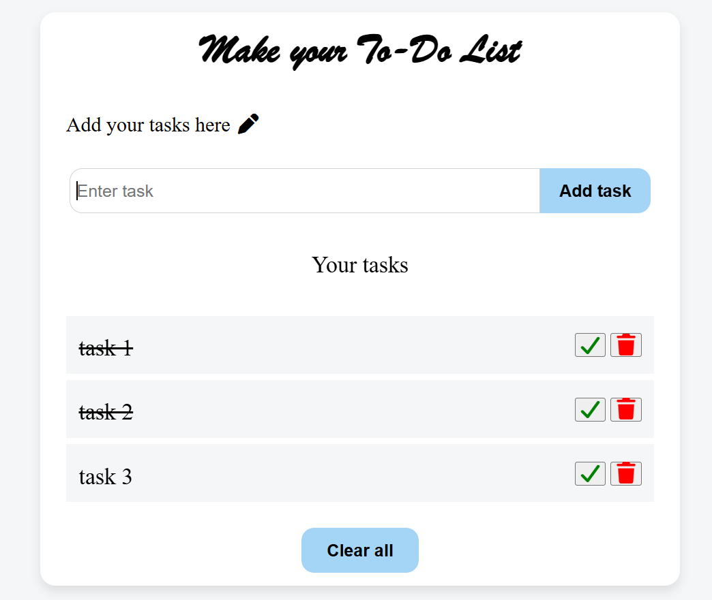

# To-Do List App

A simple, responsive to-do list app built with vanilla HTML, CSS, and JavaScript. Add, edit, complete, and delete tasks — all saved automatically using localStorage, so your list persists even after refreshing the page.

## Features

- ➕ Add new tasks
- ✏️ Edit tasks inline
- ✅ Mark tasks as complete (with strikethrough styling)
- 🗑️ Delete individual tasks
- 🧹 Clear all tasks at once
- 💾 Tasks persist across page reloads using localStorage

## Tech Stack

- HTML5
- CSS3 (Flexbox layout, responsive design)
- Vanilla JavaScript (DOM manipulation, localStorage API)
- [Font Awesome](https://fontawesome.com/) for icons

## Live Demo

[View live demo](https://to-do-list-app-ahmad.netlify.app/)

## Screenshots



## What I Learned

Building this project helped me practice:

- Dynamic DOM creation and event delegation
- Managing state in vanilla JavaScript without a framework
- Using the localStorage API to persist data between sessions
- Structuring reusable functions to avoid duplicate code

## Getting Started

To run this project locally:

1. Clone the repository
   ```
   git clone https://github.com/ahmad-wdev/to-do-list.git
   ```
2. Open `index.html` in your browser — no build step or dependencies required

## Author

**Sohail Ahmad**

- GitHub: [@ahmad-wdev](https://github.com/ahmad-wdev)
- LinkedIn: [linkedin.com/in/ahmad-wdev](https://linkedin.com/in/ahmad-wdev)
